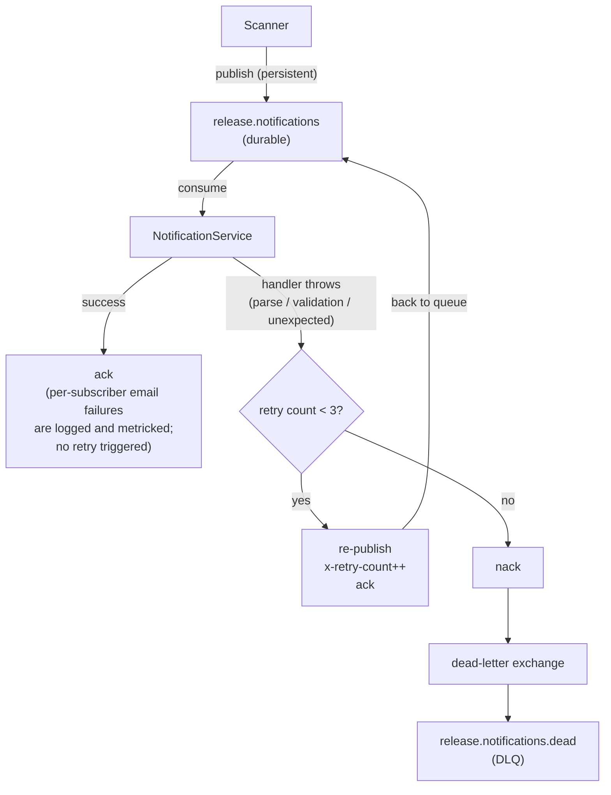

# ADR-001: RabbitMQ as Message Broker for Notifications

**Status:** Accepted

**Date:** 2026-05-08

**Author:** Vladyslav Berdychevskyi

---

## Context

The service tracks GitHub repositories and notifies subscribers when new releases appear. The scanner runs every 10 minutes (cron), polls the GitHub API for all active repositories, and upon detecting a new tag must send an email to every subscriber.

The core problem is the **gap between release detection and notification delivery**:

- Sending email is a slow and unreliable operation – SMTP can time out or become unavailable.
- The number of subscribers per repository is unbounded – a scan cycle can trigger a large burst of outgoing messages.
- If delivery fails midway, there must be a retry mechanism that does not require re-running the scanner.
- The scanner and the email sender are distinct responsibilities and should not be mixed.

A queue is therefore needed to buffer "new release detected" events and guarantee their eventual processing.

---

## Considered Alternatives

### 1. Synchronous call (no queue)

The scanner calls `MailerService` directly for each subscriber within the same scan cycle.

**Pros:** simplicity, zero external dependencies.

**Cons:**
- An SMTP error throws an exception inside the scan loop – one broken repository can disrupt the entire pass.
- No retries – an email is permanently lost on the first failure.
- The scanner holds an SMTP connection for as long as there are subscribers.
- Hard to test and scale independently.

### 2. BullMQ (Redis-based queue)

A popular Node.js library built on top of Redis Sorted Sets.

**Pros:** Redis is already in the infrastructure, simple API, built-in UI (Bull Board).

**Cons:**
- Redis is an in-memory store – without `appendonly yes` and `save` settings, messages can be lost on restart.
- BullMQ is an abstraction over Redis data structures, not a true message broker: there is no protocol-level delivery acknowledgement (AMQP ack/nack).
- Production-grade reliability requires Redis Sentinel or Cluster, which adds operational complexity.
- Tight coupling to a specific Redis client makes migration harder.

### 3. Apache Kafka

A distributed message log from Confluent.

**Pros:** horizontal scalability, retention, replay, ideal for large-scale systems.

**Cons:**
- Significant overhead for a service with a single event type: JVM, ZooKeeper/KRaft, minimum 3 brokers for production.
- The operational footprint is disproportionate to the scale of the problem.
- Consumer group offsets and partition management are unnecessary complexity for a single consumer.
- Kafka is a log, not a queue; at-least-once semantics require additional idempotency on the consumer side.

### 4. RabbitMQ (AMQP 0-9-1)

A classic message broker with support for queues, exchanges, routing keys, and DLX.

---

## Decision

**RabbitMQ is chosen.**

Queue topology:

**Key implementation properties:**
- Both the main queue and the DLQ are `durable: true`; messages are `persistent: true`. A RabbitMQ restart does not lose data.
- `MAX_RETRIES = 3`: each failed attempt increments `x-retry-count` in the message headers and re-publishes to the same queue. After 3 failures – `nack` without requeue → the message moves to the DLQ.
- On TCP disconnection, `QueueManager` reconnects with exponential backoff (1s → 2s → 5s → 10s → 30s) and after a successful reconnect re-sets up the queue and restarts the consumer.
- `sendToQueue` returns `false` when the channel write buffer is full – this is logged as a warning (backpressure signal).

---

## Consequences

### Positive

- **Reliable delivery.** Messages are persisted to disk; the scanner and the email sender can restart independently without losing events.
- **Separation of concerns.** `ScannerService` publishes a single message and forgets; `NotificationService` processes at its own pace. Each component focuses on its own responsibility.
- **Retry logic.** Message-level failures (parse/validation errors, unexpected throws in the handler) trigger up to 3 retries before the message lands in the DLQ for manual inspection. Per-subscriber email failures do not cause a handler throw — they are logged and metricked, but do not trigger message retry.
- **Observability.** The DLQ is an explicit signal of problems; a RabbitMQ Prometheus exporter or DLQ depth monitoring can be connected.
- **Testability.** `NotificationPublisher` is an interface; in unit tests `ScannerService` is mocked without a real broker.

### Negative

- **Another infrastructure dependency.** Requires a Docker container locally and in CI, and correct `RABBITMQ_URL` configuration.
- **More complex reconnect logic.** On connection loss, queues must be re-declared and the consumer re-registered on reconnect, which adds non-obvious complexity.
- **Risk of duplicate messages.** RabbitMQ guarantees at-least-once delivery. If a crash occurs between sending emails and acknowledging the message (or vice versa), an email may arrive twice. This is acceptable for the current use case – better to receive two emails than none.
- **Single instance.** The implementation relies on a single channel; parallel consumers across multiple processes will require separate channels.
