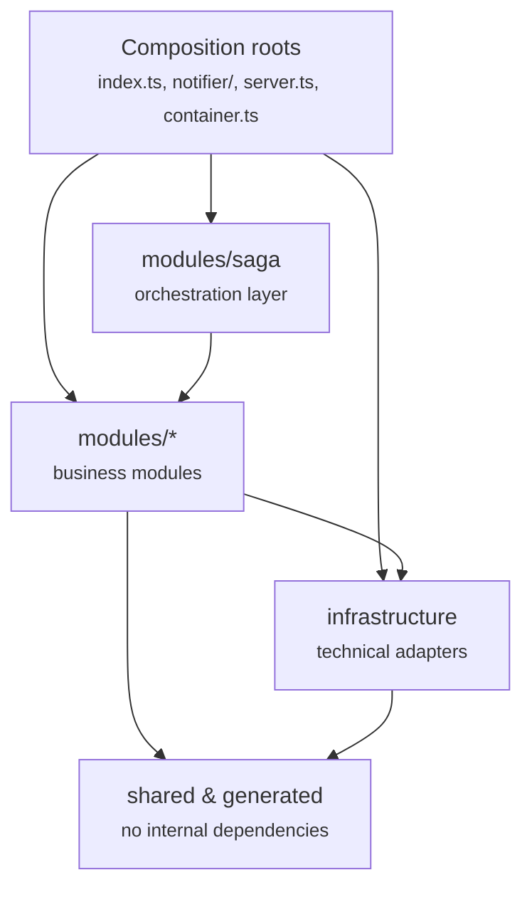
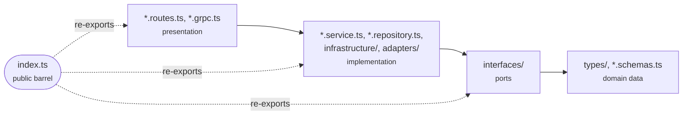

# Architecture: Layers and Module Boundaries

This document describes how the codebase is layered internally and how modules are
allowed to depend on one another. For the system-level view (processes, infrastructure,
deployment, API) see [system-design.md](./system-design.md). For decisions on specific
technology choices see [adr/](./adr).

The rules described here are intentionally kept at the layer level. The
source of truth for the exact rules is [`.dependency-cruiser.cjs`](../.dependency-cruiser.cjs);
this document explains the *why* behind them in prose.

---

## 1. Layers

Dependencies only ever point **inward**. This keeps business logic isolated from technical detail and prevents dependency
cycles between modules.

| Layer                    | Contains                                                                            | May depend on                                                                        |
|--------------------------|-------------------------------------------------------------------------------------|--------------------------------------------------------------------------------------|
| **shared / generated**   | Config, errors, logger, shared types/utils, generic Fastify plugins; protobuf stubs | Nothing internal — these are leaves                                                  |
| **infrastructure**       | Technical adapters: database, cache, queue, gRPC transport, scheduler, metrics      | shared, generated, and a module's *port* (type-only, to implement it)                |
| **modules/&lt;name&gt;** | Business modules (subscription, scanner, notification, mailer, github, repository)  | shared, infrastructure, other modules' public barrels                                |
| **modules/saga**         | Orchestration layer that composes other modules' ports to run the subscribe saga    | Everything modules can, plus other modules' barrels — but nothing depends back on it |
| **composition roots**    | `index.ts` (API process), `notifier/` (worker process), `server.ts`, `container.ts` | Everything — this is where the object graph is wired                                 |

A few consequences worth calling out:

- **`shared` has no opinions about the business.** It cannot import from `modules`,
  `infrastructure`, or a composition root. If code needs to know about a specific module, it does
  not belong in `shared`.
- **Infrastructure never contains business logic**, and never imports a module's runtime code —
  only its port (an interface), so infrastructure can implement dependency inversion without depending on how that module works.
- **`saga` sits above the other modules**, not beside them. It reads from their ports to run a
  multi-step distributed transaction. No module may import `saga`, which keeps the module graph
  acyclic — if another module needs saga behavior, it depends on a port, not on saga directly.
- **Composition roots are the only place allowed to know about everything.** Nothing outside a
  composition root depends on one, with a single carve-out: route handlers use `server.ts`'s
  `AppServer` type (type-only) to type their `server` parameter.

## 2. Inside a module

Each business module is itself layered, using a lightweight ports-and-adapters shape:

- **types / schemas** are plain data shapes. They don't know about ports or implementations —
  they're the innermost layer of the module.
- **interfaces (ports)** describe a contract in terms of the module's own types. A port must
  never depend on an implementation (its own `infrastructure/`/`adapters/`, or `src/infrastructure`)
  — that would defeat the point of depending on an abstraction.
- **implementation** (services, repositories, adapters) implements the ports and is where the
  module talks to the database, other modules' barrels, or infrastructure.
- **presentation** (`*.routes.ts`, `*.grpc.ts`) adapts implementation to a transport (REST, gRPC)
  and has the same dependency rights as implementation.
- **`index.ts`** is the module's only public door. Everything another module needs is re-exported
  from here — reaching into a module's internals from outside it is not allowed.

## 3. Cross-module communication

- Modules only ever import each other through the target module's barrel (`@/modules/<name>`),
  never through a deep path into its internals. This is enforced by ESLint rather than dependency-cruiser, because it
  needs to tell "importing my own module" apart from "importing another module" — something a
  path-only rule can't express.
- Where a module needs behavior from another without creating a hard dependency, the dependency is expressed
  as a port owned by the *consuming* module, implemented by an adapter. The concrete transport is
  chosen and wired at the composition root.

## 4. Two runtime processes, one codebase

The service ships as two composition roots that share the same `modules`/`infrastructure`/`shared`
code but run as separate processes:

- **`src/index.ts`** — the API process: REST + gRPC servers, subscription management, the release
  scanner, and the subscribe saga orchestrator.
- **`src/notifier/index.ts`** — the notifier worker: consumes the notification and saga-command
  queues, sends email via the mailer module, and exposes its own health/metrics endpoints.

Both are thin — they wire dependencies (via `container.ts` for the API process) and start
consumers/servers, but contain no business logic themselves. See
[system-design.md # 3](./system-design.md#3-architecture) for the process-level data-flow diagram.

## 5. Enforcement

The rules in this document are checked automatically, not just followed by convention:

- **`.dependency-cruiser.cjs`** encodes the layer rules and runs via `npm run arch:check`.
- **`tests/architecture/dependency-rules.spec.ts`** runs the same check through Vitest
  (`npm run test:arch`), so a boundary violation reads like a regular test failure. It runs under
  its own config and its own CI job.
- **ESLint** enforces the barrel-only rule for cross-module imports.
- **`npm run arch:graph`** renders the current dependency graph to `docs/architecture-graph.svg`
  for ad-hoc, file-level inspection — useful for debugging a specific violation, but not kept
  committed since it's fully derived from the source tree.

## 6. Why layer it this way

- **Business logic stays testable without infrastructure.** A module's service depends on its own
  ports, so tests can supply an in-memory fake instead of a real database or queue.
- **Infrastructure is replaceable.** Swapping Redis for another cache, or RabbitMQ for another
  broker, means changing an adapter in `infrastructure/`, not the modules that use it.
- **No accidental cycles.** Keeping `saga` one-directional and forcing cross-module access through
  barrels makes the module graph a DAG, which is what actually lets modules be reasoned about (and
  tested) independently.
