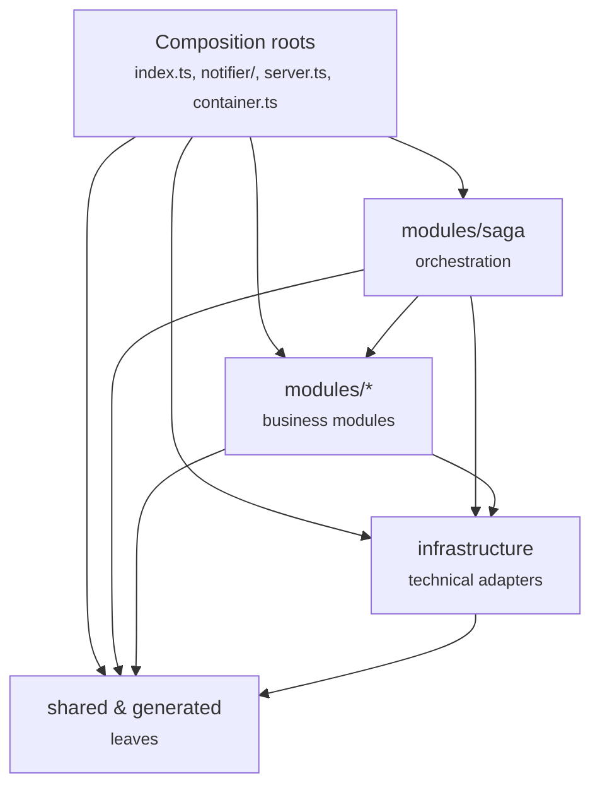
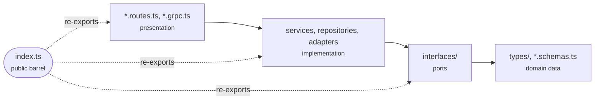

# Application Architecture

This document describes the internal architecture of the application: what it consists
of, how the parts are grouped into layers, and how those boundaries are enforced.
For the system-level view (requirements, API, deployment, observability) see
[system-design.md](./system-design.md); for individual technology decisions see [adr/](./adr).

The full component diagram — both processes, their modules, backing services, and
external systems — lives in [architecture.mmd](./architecture.mmd).

---

## 1. Bird's-eye view

The application is a modular monolith that ships as **two processes sharing one codebase**:

- **API process** (`src/index.ts`) — REST and gRPC servers for subscription management,
  the release scanner cron job, and the subscribe-saga orchestrator. Dependencies are
  wired in `container.ts`, servers in `server.ts`.
- **Notifier worker** (`src/notifier/index.ts`) — owns all outbound email: consumes the
  release-notification and saga-command queues, serves the saga-mail gRPC endpoint, and
  exposes its own health/metrics endpoints.

The processes communicate only through RabbitMQ or gRPC — never through shared memory
or each other's data. Both composition roots are thin: they wire the object graph and
start servers/consumers, but contain no business logic themselves.

## 2. Modules

Business logic lives in `src/modules/*`; each module owns one capability:

| Module           | Responsibility                                                                                                                             |
|------------------|--------------------------------------------------------------------------------------------------------------------------------------------|
| **subscription** | Subscribe / confirm / unsubscribe / list flows; exposes them over REST routes and gRPC handlers                                            |
| **saga**         | Orchestrates the multi-step subscribe transaction: persist the pending subscription, request the confirmation email, compensate on failure |
| **scanner**      | Periodically polls tracked repositories for new releases and publishes notification messages                                               |
| **notification** | The release-notification queue: message schema, publishing, and consumption with retry + dead-letter handling                              |
| **mailer**       | Composes and sends email (confirmation, release notification) through an SMTP transport                                                    |
| **github**       | GitHub HTTP client, wrapped in caching (Redis) and metrics decorators                                                                      |
| **repository**   | Persistence of tracked repositories and their confirmed subscribers                                                                        |

Technical concerns live outside the modules:

- **`src/infrastructure`** — adapters for the database (Drizzle + unit of work), cache
  (Redis), queue (RabbitMQ), gRPC transport, cron scheduler, and Prometheus metrics.
- **`src/shared`** — config, errors, logger, lifecycle helpers, and generic Fastify
  plugins. Knows nothing about the business.
- **`src/generated`** — protobuf stubs generated from `proto/`.

## 3. Layers

Dependencies only ever point **inward** — business logic stays independent of technical
detail, infrastructure stays replaceable, and the module graph stays acyclic:

The key rules, from the bottom up:

- **`shared` and `generated` are leaves** — they depend on nothing internal. If code
  needs to know about a specific module, it does not belong in `shared`.
- **`infrastructure` contains no business logic.** It may implement a module's port
  (type-only import of the interface), but never imports a module's runtime code.
- **Modules talk to each other only through public barrels** (`@/modules/<name>`),
  never through deep paths into another module's internals.
- **`saga` sits above the other modules**, composing them into a distributed
  transaction. It has the same dependency rights as any module (infrastructure, shared)
  plus the other modules' barrels; nothing imports `saga` back, which keeps the module
  graph a DAG.
- **Composition roots are the only place allowed to know about everything.** Nothing
  outside them depends on one (single type-only carve-out: routes use the `AppServer`
  type from `server.ts`).

## 4. Inside a module

Each business module follows the same lightweight ports-and-adapters shape:

- **types / schemas** — plain data shapes, the innermost layer of the module.
- **interfaces (ports)** — contracts expressed in the module's own types; a port never
  depends on an implementation.
- **implementation** — services, repositories, and adapters that fulfil the ports and
  talk to infrastructure or other modules' barrels.
- **presentation** — adapts the implementation to a transport (REST, gRPC).
- **`index.ts`** — the module's only public door; everything another module may use is
  re-exported here.

When a module needs behavior from another without a hard dependency, it declares a port
it owns, and an adapter is wired in at the composition root. This is why the confirmation
email can travel over either RabbitMQ or gRPC — the saga depends on a
`ConfirmationEmailSender` port, and the transport is chosen by configuration.

## 5. Enforcement

The boundaries above are checked automatically, not just followed by convention:

- **[`.dependency-cruiser.cjs`](../.dependency-cruiser.cjs)** encodes the layer rules —
  it is the source of truth for the exact constraints; this document explains the *why*.
  Runs via `npm run arch:check`.
- **`tests/architecture/dependency-rules.spec.ts`** runs the same check as a Vitest
  suite (`npm run test:arch`) with its own CI job, so a violation reads like a regular
  test failure.
- **ESLint** enforces the barrel-only rule for cross-module imports (dependency-cruiser
  can't distinguish "my own module" from "another module" by path alone).
- **`npm run arch:graph`** renders the current file-level dependency graph to an SVG —
  useful for debugging a specific violation; not committed, since it's derived from the
  source tree.
