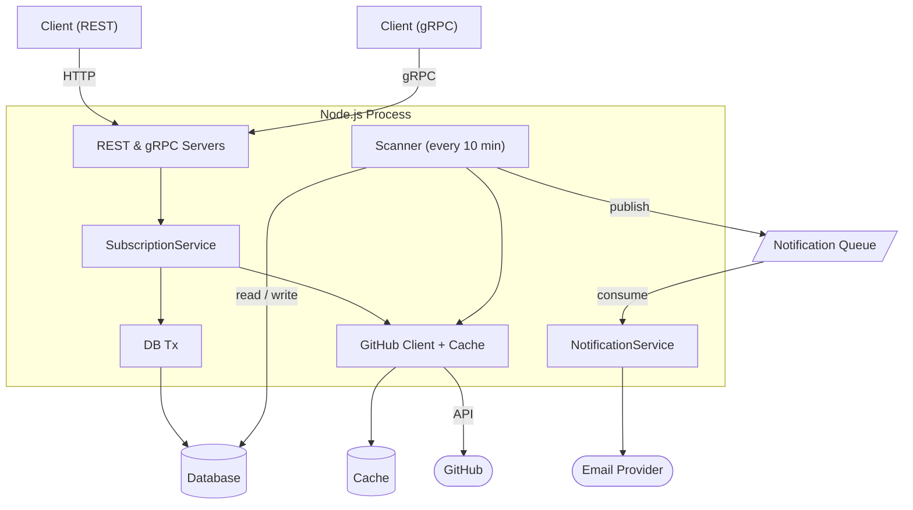

# System Design: GitHub Release Notifier

## 1. Overview

The service tracks GitHub repositories and sends email notifications to subscribers when new releases appear. A user subscribes to a repository, confirms their email, and from that point receives a message every time a new release is published.

---

## 2. Requirements

### Functional

| #  | Requirement                                                                                   |
|----|-----------------------------------------------------------------------------------------------|
| F1 | A user can subscribe to a repository by providing an email and `owner/repo`                   |
| F2 | A subscription becomes active only after email confirmation (double opt-in)                   |
| F3 | A user can unsubscribe via a unique token included in every notification email                |
| F4 | A user can retrieve a list of their subscriptions by email                                    |
| F5 | The service automatically detects new GitHub releases every 10 minutes                        |
| F6 | When a new release is detected, all confirmed subscribers of that repository receive an email |
| F7 | All features are accessible via both REST API and gRPC                                        |

### Non-Functional

| #  | Requirement                                                                                                                                                                                                                                                                |
|----|----------------------------------------------------------------------------------------------------------------------------------------------------------------------------------------------------------------------------------------------------------------------------|
| N1 | **Reliable delivery:** release notification messages are never silently lost; failed deliveries are retried automatically, and persistent failures are quarantined for manual inspection. Per-subscriber email failures are isolated and do not block other notifications. |
| N2 | **Fault tolerance:** temporary unavailability of the messaging system or email provider must not interrupt the scanner                                                                                                                                                     |
| N3 | **Observability:** Prometheus metrics for HTTP, GitHub API, scanner, and notifications; structured logs                                                                                                                                                                    |
| N4 | **Graceful shutdown:** on SIGTERM the service finishes active requests and closes all connections                                                                                                                                                                          |
| N5 | **Security:** all protected endpoints must verify client identity through a standardized authentication mechanism; public endpoints remain accessible without authentication                                                                                               |
| N6 | **Consistency:** subscription is an atomic operation (find-or-create repo + create subscription in one transaction)                                                                                                                                                        |

### Constraints

- **GitHub API rate limit:** unauthenticated access has a low hourly cap; a token is required for tracking more than a handful of repositories.
- **Email delivery:** an external provider; latency and availability are outside the service's control – hence the queue.
- **Single process:** the current architecture is a monolithic Node.js process. Horizontal scaling will require an external scheduler for the cron job (to prevent parallel scan runs).

---

## 3. Architecture



---

## 4. API Reference

### REST

The API exposes two groups of routes:

- **Subscription management** — protected by authentication when configured.
- **Infrastructure** (health check, metrics) — always public.

**Response codes:**
- `200` – success
- `400` – validation error (invalid email, wrong repo format)
- `401` – missing or incorrect API key
- `404` – token not found / repository does not exist on GitHub
- `409` – subscription already exists
- `429` – GitHub rate limit hit

### gRPC

Mirrors all REST subscription operations via protobuf RPC. See the `proto/` directory for full service definitions. Both transports delegate to the same service.

---

## 5. Infrastructure and Deployment

### Local Development

`docker-compose.yml` including the `notifier-api` container. For local development, bring up only the infrastructure services and run the app directly:

```bash
docker compose up -d notifier-postgres notifier-redis notifier-rabbitmq
npm run dev
```

### Production

```bash
docker compose -f docker-compose.prod.yml up 
```

The service runs as a single Docker container; infrastructure services run as separate containers in the same network.

**Environment variables:** see `.env.example` for the full list with descriptions.

### Integration Tests

```bash
npm run test:integration
```

Separate ports prevent conflicts with the local dev environment during test runs.

---

## 6. Observability

### Metrics

Prometheus metrics cover HTTP requests, GitHub API calls, scanner activity, and notification delivery outcomes. Default Node.js runtime metrics (event loop, heap, GC) are also exported.

### Logging

Structured JSON logs at `info` / `warn` / `error` levels covering queue lifecycle, scan activity, notification delivery, and cache behavior.

### Graceful Shutdown

On `SIGTERM` the service stops accepting new requests, finishes active ones, then closes all infrastructure connections in order.
